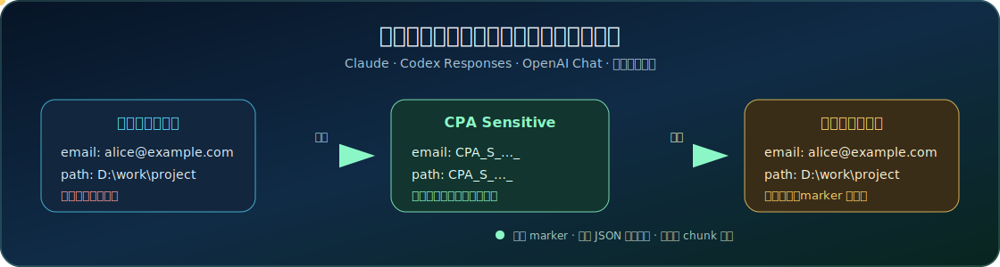

# SensitivePromptMasker

简体中文 | [English](README.md)

<p align="center">
  
</p>

<p align="center">
  <a href="https://github.com/Ironboxplus/SensitivePromptMasker/releases/latest"></a>
  <a href="https://github.com/Ironboxplus/SensitivePromptMasker/actions/workflows/build.yml"></a>
  
  
</p>

一句话说明：**把邮箱、Token、本机路径等内容发给模型前先打码，模型响应回来后再自动换回原文。**

它是一个独立的 CPA（CLIProxyAPI）官方动态插件，插件 ID 是 `cpa-sensitive`。核心检测、映射、流式恢复和协议适配全部用 Go 实现；`.so` / `.dll` / `.dylib` 只是 CPA 加载插件所需的动态库外壳，不需要你写 C，也不需要额外运行一个服务。

## 什么时候需要它

下面这些内容经常会跟着提示词、工具参数或终端输出一起发给模型：

- 公司邮箱、手机号、身份证号、银行卡号；
- Windows、Linux、macOS 本地文件路径；
- JWT、API Key、带密码的 URL、Git 凭据；
- 内网 IP、IPv6、MAC 地址、用户名和主机名；
- Claude/Codex 调用工具时产生的 JSON 参数；
- 自己定义的项目代号、域名或内部 Token 格式。

SensitivePromptMasker 会在 CPA 把请求交给 provider 之前替换这些内容，并在响应返回客户端之前恢复。客户端最终仍能看到原始路径和参数，模型侧看到的是稳定 marker。

## 它怎么工作

```text
Claude Code / Codex / Cursor / 其他客户端
                    │
                    ▼
            CPA request interceptor
                    │
       关键词替换（可选 list/map）
                    │
       Privacy Shield 自动检测与脱敏
                    │
                    ▼
          Claude / OpenAI / 其他上游
                    │
                    ▼
       非流式 JSON 或流式 SSE 响应
                    │
       按当前请求的映射自动恢复
                    │
                    ▼
                 客户端
```

插件不会把原文塞进 marker。`v0.1.1` 的 marker 根据 JSON 位置、规则 ID 和命中序号稳定生成，因此同一会话不会因为每轮随机 nonce 不同而持续打穿 Claude prompt cache。

## 已适配的协议

| 客户端格式 | 已处理内容 |
| --- | --- |
| Claude Messages | `system`、消息文本、`thinking`、`partial_json`、tool input、SSE delta |
| Codex / OpenAI Responses | `instructions`、结构化 `input`、`output_text.delta`、function-call arguments、completed events |
| OpenAI Chat Completions | 普通文本、reasoning、tool calls、tool arguments、流式 delta |
| Provider 原生 JSON | 即使 CPA 标记的 `SourceFormat` 与 chunk 实际形态不同，也会按事件内容识别 |

协议结构字段不会被当成普通文本乱改。比如 Claude 的：

```json
{
  "context_management": {
    "edits": [
      {
        "type": "clear_thinking_20251015"
      }
    ]
  }
}
```

其中 `type` 是协议枚举，不会被替换成 marker。工具名、tool reference、thinking signature、图片 base64 等不应触碰的字段也有专门保护。

## 五分钟安装

### 1. 下载

从 [Releases](https://github.com/Ironboxplus/SensitivePromptMasker/releases/latest) 下载与你的 CPA 主机匹配的压缩包。

常见文件：

```text
cpa-sensitive_<版本>_linux_amd64.zip
cpa-sensitive_<版本>_linux_arm64.zip
cpa-sensitive_<版本>_windows_amd64.zip
cpa-sensitive_<版本>_darwin_arm64.zip
```

### 2. 放进 CPA 插件目录

解压后保持固定插件名：

```text
plugins/linux/amd64/cpa-sensitive.so
plugins/linux/arm64/cpa-sensitive.so
plugins/windows/amd64/cpa-sensitive.dll
plugins/darwin/arm64/cpa-sensitive.dylib
```

CPA 使用 C ABI 加载动态库，但插件业务代码仍然是 Go。Linux 用 `.so`、Windows 用 `.dll`、macOS 用 `.dylib`，这是操作系统动态库格式的区别。

### 3. 打开插件

推荐先用下面这份配置：

```yaml
plugins:
  enabled: true
  dir: plugins
  configs:
    cpa-sensitive:
      enabled: true
      priority: 10

      # 自定义 list/map 关键词替换。没配置规则时可以关闭。
      sanitization:
        enabled: false
        replacement_groups: []

      # 自动隐私检测与可逆恢复。
      privacy_shield:
        enabled: true
        gitleaks: true
        pii_enabled: true
        pii_aggressive: false
        max_body_bytes: 1048576
        max_string_bytes: 262144
        max_findings: 0

        pii_types:
          gitleaks: true
          email: true
          phone: true
          national_id: true
          bank_card: true
          ip: true
          jwt: true
          uuid: true
          credential_url: true
          mac_address: true
          ipv6: true
          path: true
          generic_token: true

        pii_aggressive_types:
          relative_path: false
          username_hostname: false
          generic_token: false
          loose_secret: false

        custom_rules: []

      session:
        ttl_seconds: 86400
        max_sessions: 4096
```

重启 CPA 后，日志里应该出现：

```text
pluginhost: plugin loaded plugin_id=cpa-sensitive
pluginhost: plugin registered plugin_id=cpa-sensitive
```

运行状态接口：

```text
/v0/resource/plugins/cpa-sensitive/status
```

## 普通模式和激进模式怎么选

建议先开普通模式：

```yaml
pii_aggressive: false
```

普通模式主要处理明确的邮箱、电话、证件、Token、凭据 URL 和绝对路径，误报更少。

如果你明确需要把相对路径、用户名/主机名、宽松 Secret 也全部处理，可以打开：

```yaml
pii_aggressive: true
```

激进模式召回率更高，但普通源码标识符、测试字符串和相对路径也更容易被命中。`v0.1.1` 已排除公开的 `mcp__...` 工具标识符、纯小写自然单词组成的长标识符，以及 `20260716`、`2026-07-16` 这类日期误报。

## 自定义关键词 list/map 替换

`sanitization` 和 `privacy_shield` 是两套独立功能：

- `sanitization`：你明确提供 `src -> dst`，适合替换公司名、客户端名、域名等固定文本；
- `privacy_shield`：自动检测秘密和 PII，并为当前请求保存可逆映射。

示例：

```yaml
sanitization:
  enabled: true
  replacement_groups:
    - id: internal-names
      models: ["claude-*", "gpt-*"]
      source_formats: ["claude", "openai", "openai-response"]
      replacements:
        - id: company-name
          src: "Example Internal"
          dst: "Example Company"
          order: 10
        - id: private-host
          src: "gateway.internal.example"
          dst: "api.example.com"
          order: 20
```

需要按正则识别自定义 Secret 时，放进 `privacy_shield.custom_rules`：

```yaml
privacy_shield:
  custom_rules:
    - id: internal-token
      description: Internal token syntax
      regex: 'secret_[A-Za-z0-9]{24,}'
```

## Logs Viewer 里能看到什么

插件通过 CPA 官方 `host.log` 回调写入主日志，所以在管理面板：

```text
Logs Viewer
Current runtime: CPA
Log Content
```

可以看到：

```text
SensitivePromptMasker request.redacted count=3 source=claude target=claude ...
SensitivePromptMasker response.restored count=1 source=claude ...
```

日志只包含：

- 阶段；
- 命中/恢复数量；
- 规则计数；
- 模型和协议；
- 是否流式；
- 处理耗时；
- CPA request ID。

不会记录原始 Secret、请求正文或 marker 内容。

要注意，CPA 的详细 request log 位于插件隐私边界之外，它可能记录客户端发进来的原始请求以及恢复后的响应。生产环境建议关闭：

```yaml
request-log: false
```

正常的 `main.log` 和 Logs Viewer 可以继续使用。

## `v0.1.2` 修了什么

- 修复文件名、目录名和 `working_directory` 在工具调用中变成 marker 后无法恢复的问题；
- session 关联同时使用 CPA request ID、`RequestBody`、`OriginalRequest` 和 body hash；
- 即使 CPA 翻译或后置插件改写了请求 JSON，也能通过无歧义的 marker 映射找回正确 session；
- 非流式结束、流式结束、TTL 和容量淘汰都会一次清理同一 session 的全部 alias；
- 新 marker 改为纯字母数字 `CPAS...`，不含需要 JSON / shell 转义的特殊字符；
- 恢复端继续兼容 `CPA_S_..._` 和 `CPA_RESTORE_SECRET_...` 旧格式；
- Haiku 实机验证覆盖 OpenAI Chat、Claude Messages、Codex Responses 的非流式和流式工具参数，6/6 均发生真实脱敏与恢复，且没有 marker 泄漏。

## `v0.1.1` 修了什么

- marker 跨请求、跨进程和 CPA 重启保持稳定，避免持续破坏 Claude prompt cache；
- 不再把 `mcp__...` 工具 ID 当成通用 Token；
- 不再把日历日期当成手机号；
- 只改写实际命中的 JSON string span，未命中的字段顺序、空白和转义保持原样；
- duplicate-key 等少见合法 JSON 无法安全定位时，保留兼容 fallback；
- Claude、Codex Responses、OpenAI Chat 的 tool arguments 都支持非流式与流式恢复；
- `X-Forwarded-Host` 发往上游前会被改成 `api.anthropic.com`；
- Logs Viewer 增加规则计数和脱敏/恢复耗时，但不泄露原文。

## 为什么不是一个独立 HTTP 服务

因为它需要在 CPA 已经完成协议识别和 provider 路由之后拿到最终请求，同时还要在响应回给客户端之前恢复内容。做成 CPA 官方 interceptor 插件，可以直接复用：

- `SourceFormat` / `ToFormat`；
- 请求和响应生命周期；
- CPA request ID；
- 流式 chunk 回调；
- 主日志和管理资源接口。

如果做成外置反向代理，还要重新实现这些协议边界，并处理两层流式代理和状态关联，部署也会更复杂。

## 从源码构建

先运行测试：

```bash
go test ./...
go vet ./...
```

构建当前平台动态库：

```bash
make build VERSION=0.1.2
```

或者直接：

```bash
CGO_ENABLED=1 go build -trimpath -buildmode=c-shared \
  -ldflags "-s -w -X main.cpaSensitivePluginVersion=0.1.2" \
  -o cpa-sensitive.so .
```

本项目的 GitHub Actions 会对 `main` 和 `v*` tag 运行测试，并构建 Linux、Windows、macOS 和 FreeBSD 产物。tag 构建成功后会自动创建 GitHub Release，同时发布压缩包和 SHA-256 校验文件。

## 已知边界

- 插件只能修改 CPA 官方 plugin ABI 暴露出来的请求和响应；CPA 在插件执行前已经写入的原始 request log 不受插件控制。
- `privacy_shield` 保护的是经过 CPA 的模型请求，不等于磁盘全盘加密或客户端本地防泄漏。
- 自动检测永远存在误报和漏报的可能，重要的内部格式建议增加 `custom_rules`。
- 流式恢复仍依赖进程内 session 映射；CPA 重启后，已经在途的旧流无法继续恢复。
- `pii_aggressive: true` 不应在不了解误报范围时直接用于所有生产流量。

## 致谢

- CPA 官方动态插件 SDK；
- [`router-for-me/cpa-plugin-jshandler`](https://github.com/router-for-me/cpa-plugin-jshandler) 参考插件；
- Gitleaks 检测能力；
- Octopus prompt sanitization / Privacy Shield 的兼容配置设计。

第三方组件和发布辅助代码的许可证说明见 [THIRD_PARTY_NOTICES.md](THIRD_PARTY_NOTICES.md)。
